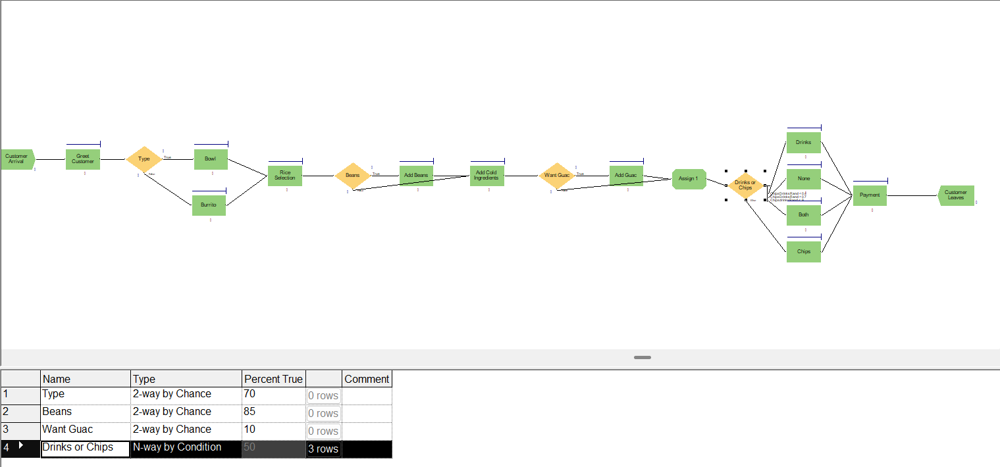
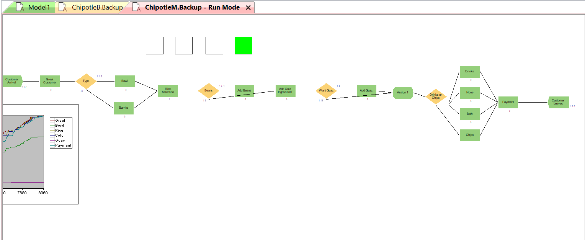

# Chipotle Arena Simulation  

This project models a Chipotle-style restaurant using Arena to study customer flow, identify bottlenecks, and test staffing changes.  

---

## 🖥 Arena Flow Models  

**Employees Only**  
  

**With Manager**  
  

---

## 📊 Comparison Table  

| Metric                | Employees Only | With Manager |
|------------------------|----------------|--------------|
| Customer.NumberOut     | 138            | 160          |
| Employee.Utilization   | 85.8%          | 76.6%        |
| Manager.Utilization    | —              | 66.2%        |
| Avg WaitTime (secs)    | 266.44         | 281.79       |
| Avg TotalTime (secs)   | 431.63         | 448.01       |

📂 [Download Excel Comparison](EmployeeVsManager.xlsx)  

---

## 🔑 Insights  

- Adding a manager reduced strain on employees and improved throughput.  
- Bottlenecks shifted from bowls and chips to guacamole.  
- Recommended: cross-train staff or add guac support during peak times.  
