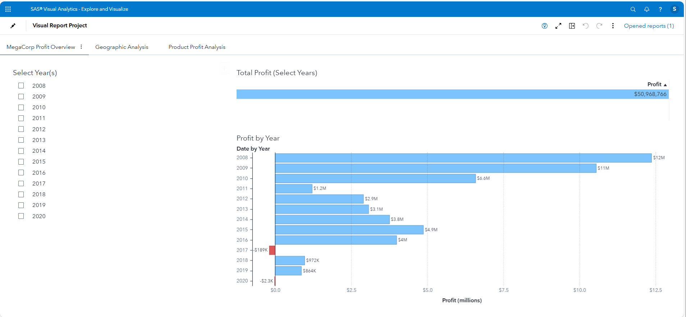
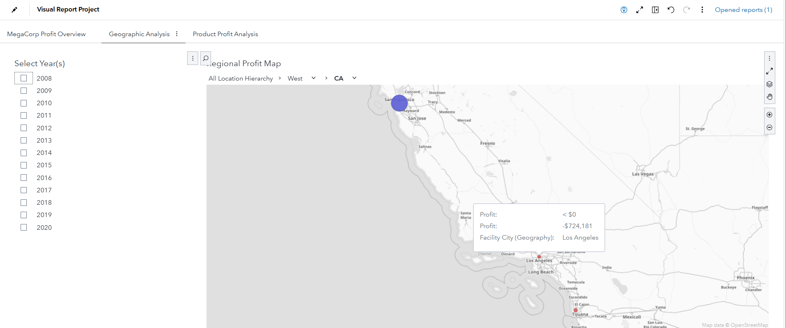

# SAS Visual Analytics Dashboard

This project includes dashboard pages exported from SAS Visual Analytics.  
Screenshots below show the visuals and drill-downs, with brief explanations.

---

## 📌 Screenshot 1 — Regional Performance Overview  
Displays overall performance trends, broken down by state.

---

## 📌 Screenshot 2 — Geographic Drill-Down  
Shows interactive drill-down map allowing state-to-city exploration.

---

## 📌 Screenshot 3 — Product Comparison  
Compares product lines by profit and volume to identify top performers.

---

## 📌 Screenshot 4 — Detail Table View  
Tabular display for reviewing specific data components within dashboards.

---

### 🔹 Files Included  
✔ Exported PDF dashboard report  
✔ Four screenshots with explanations
