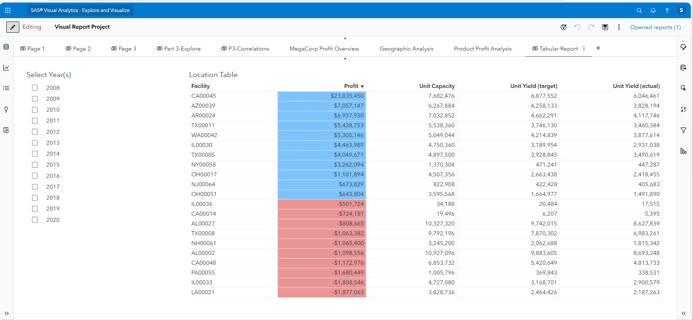

# SAS Visual Analytics Dashboard

This project includes dashboard pages exported from SAS Visual Analytics.  
Screenshots below show key visuals and drill-downs, along with short explanations of what each page communicates.

---

## 📌 Screenshot 1 — Regional Performance Overview
Displays overall performance trends broken down by state.

---

## 📌 Screenshot 2 — Geographic Drill-Down  
Shows interactive mapping and drill-down navigation from region to state to city performance.

---

## 📌 Screenshot 3 — Product Comparison  
Compares major product lines by profit and volume to reveal top performers.

---

## 📌 Screenshot 4 — Detail Table View  
Tabular display for reviewing facility-level data such as profit, capacity, and yield.

---

## 🔑 Insights

- Facility profitability varies significantly across states and product lines.
- Geographic drill-downs help isolate high-performing regions and areas needing attention.
- Tabular views give leadership targeted visibility into performance details for decision-making.
