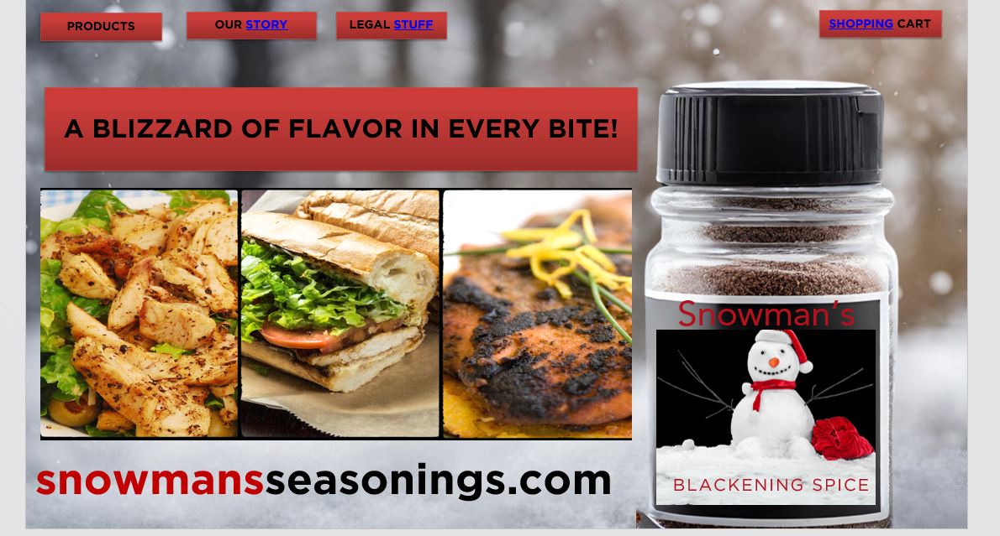

# Snowman's Seasonings  

Snowman’s Seasonings is a small-batch spice company with the mission to *“transform everyday cooking into a gourmet experience.”*  

---

## 📂 Project Files  
## 📸 Website Mock-Up Preview  

 
- 📊 [Business Proposal (Word Document)](Snowhill.Amy.Marketing.docx)  
- 🖥️ [Website Mock-Up (PowerPoint)](Amy.Snowhill.Snowman.pptx)  

---

## 🔑 Key Highlights  
- Five proprietary spice blends: **Blackening Spice, Spicy Sugar, Jerk Seasoning, Curry Spice, Season Salt**  
- Pricing: $4.00/oz  
- Target market: Gen Z & Millennial adventurous home cooks (18–40)  
- Marketing channels: TikTok, Facebook, YouTube, blog, local radio  
- Growth plan: expand product line, reach $50K in sales, move into national retail  

---

## 📢 Slogan  
*A Blizzard of Flavor in Every Bite*
