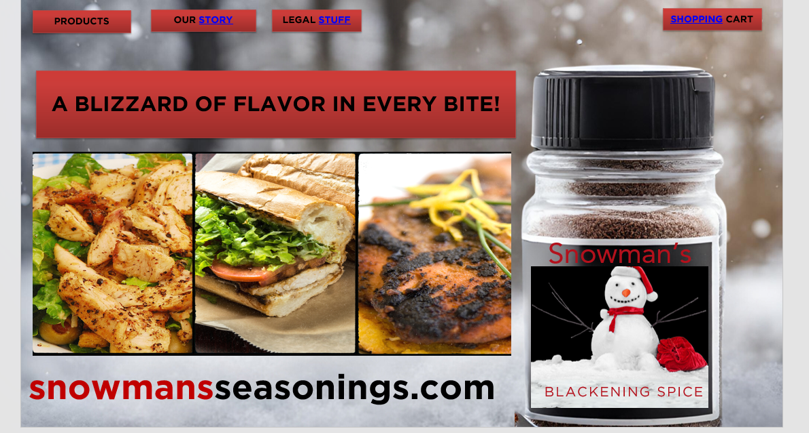

# Snowman's Seasonings  

Branding, strategy, and mock-website concept for a start-up spice company.  
Deliverables include a business plan, market research, pricing model, website mock-up, and visual branding assets.  

---

## 📂 Project Files  

📄 **Business Plan & Marketing Strategy (Word Document)**  
Includes pricing model, target audience analysis, distribution channels, and growth goals.  
👉 [Open File](./SnowmanMarketing.pdf)  

📊 **Website Mock-Up (PowerPoint)**  
Visual layout, messaging concepts, imagery, and promotional design.  
👉 [Open File](SnowmanPP.pdf)  

---

## 📸 Website Preview  

---

## 🔑 Key Highlights  

- Five proprietary spice blends: **Blackening Spice, Spicy Sugar, Jerk Seasoning, Curry Spice, Season Salt**  
- Pricing: **$4.00 per ounce**  
- Target audience: **Gen Z & Millennial home cooks (ages 18–40)**  
- Marketing channels: **TikTok, Facebook, YouTube, blog, local radio**  
- Growth plan: **expand product line, reach $50K in sales, enter national retail distribution**  

---

## 📢 Slogan  

*A Blizzard of Flavor in Every Bite*
