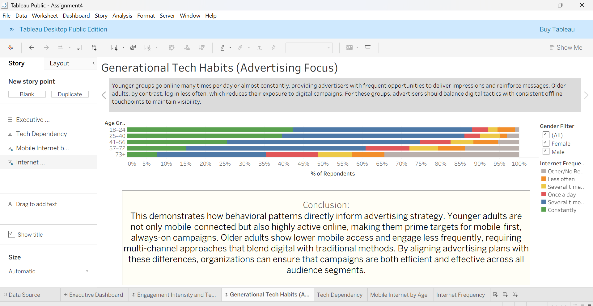

# 📊 Tableau Survey Project  

This project includes a dashboard and two visual stories based on survey results.  
Screenshots represent the dashboard and story output created in Tableau.

---

## 📌 Dashboard — Mobile Internet Use by Age

Shows differences in mobile internet usage across age groups and difficulty giving up smartphones.

---

## 📌 Story 1 — Engagement & Tech Dependency  

Highlights how age influences internet frequency and technology reliance.

---

## 📌 Story 2 — Generational Tech Habits  

Shows behavioral patterns that inform advertising focus and targeting.

---

## 🔍 Key Insights  

- Younger adults are heavy, always-connected mobile users — valuable for mobile-first campaigns.  
- Older groups access less often, requiring multi-channel strategies.  
- Different behaviors suggest targeted marketing strategies by age segment.  

